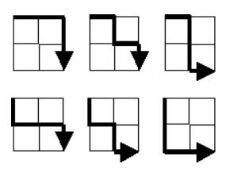

# Question
Starting in the top left corner of a 2×2 grid, and only being able to move to the right and down, there are exactly 6 routes to the bottom right corner.

How many such routes are there through a 20×20 grid?

## Answer

- Define a constant `N` that represents the size of the grid.

- Initialize a 2D array `grid` with size (N+1)x(N+1) and fill it with zeros.

- Set the base cases for the edges of the grid, where there is only one way to reach them (by moving either right or down).

- Calculate the number of routes for each position in the grid. For each position `(i, j)`, the number of routes is equal to the sum of the number of routes from the position to the left `(i-1, j)` and from the position above `(i, j-1)`.